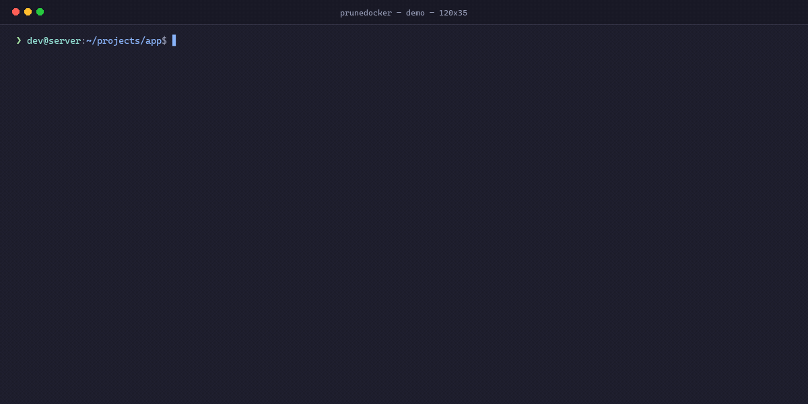
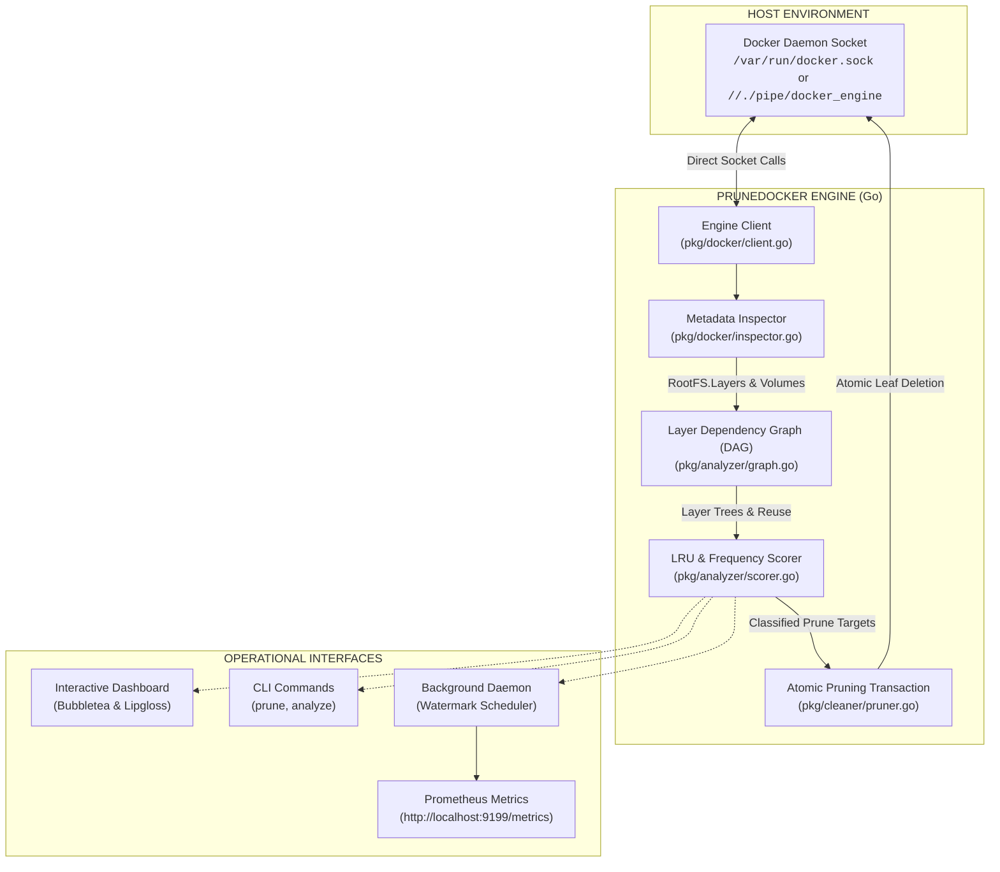
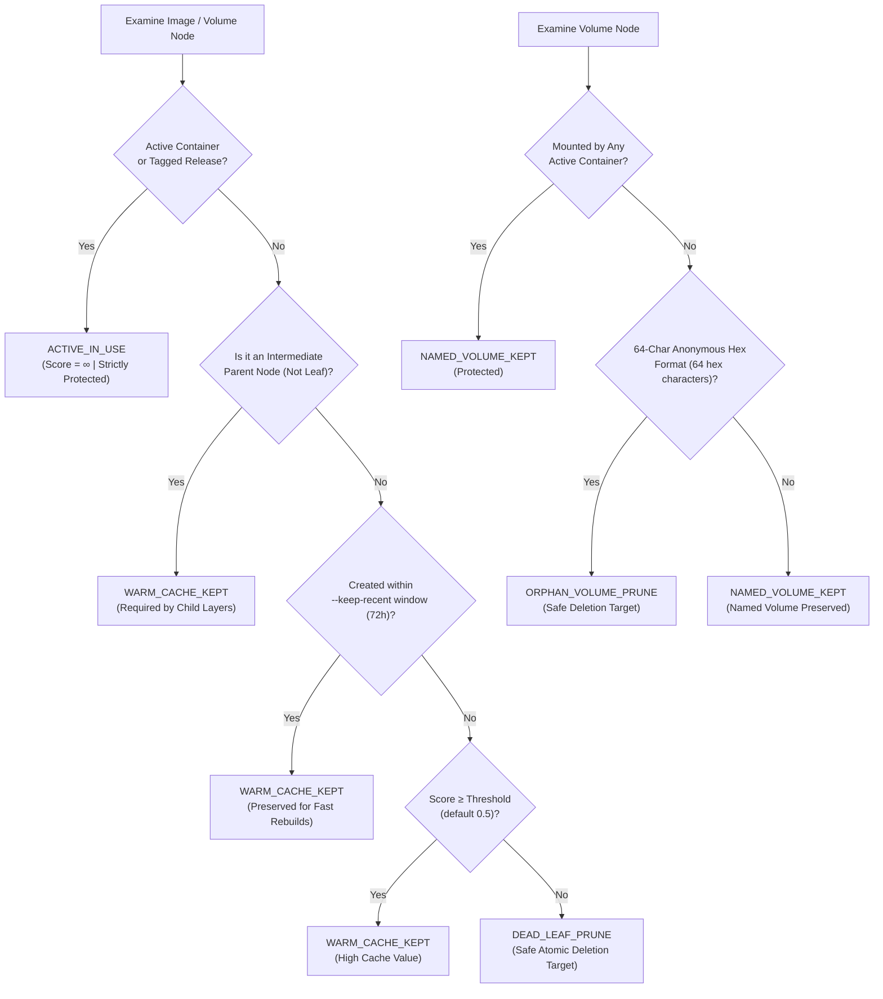

<div align="center">

# 🐳 PruneDocker

### Intelligent, Layer-Preserving Docker Cache Optimizer & Cleanup Daemon

[](https://github.com/Minhaj009/PruneDocker/actions/workflows/ci.yml)
[](https://go.dev)
[](https://www.docker.com/)
[](https://github.com/charmbracelet/bubbletea)
[](https://prometheus.io/)
[](LICENSE)
[](verify.ps1)
[](#zero-cost-architecture)

<br/>

**PruneDocker** connects directly to your local Docker socket to compute an AST-like cache dependency graph across multi-stage builds.
It safely reclaims gigabytes of disk space by pruning dead leaf blobs and orphaned anonymous volumes **without invalidating warm build caches**.

<br/><br/>

<p align="center">
  
</p>

<br/>

[Features](#-key-features) •
[Architecture](#-system-architecture) •
[Scoring Formula](#-cache-scoring-formula) •
[Quickstart](#-quickstart--one-liner-install) •
[Benchmark](#-2-step-local-benchmark-traditional-prune-vs-prunedocker) •
[Server Deployment](#-production-server-deployments) •
[Development Scenarios](#-development--ci-scenarios) •
[Prometheus & Grafana](#-observability--prometheus-metrics) •
[Offline Testing](#-100-serverless-offline-testing)

</div>

---

## ⚡ The Problem: Why `docker system prune` Destroys Velocity

Every container engineer and CI engineer has encountered disk exhaustion:
```
no space left on device: /var/lib/docker/overlay2
```

The standard fix recommended across the internet is `docker system prune -a`.
However, standard Docker pruning is a **blunt sledgehammer**:
* ❌ It wipes all intermediate layers, including your warm `go mod download`, `npm install`, and `pip install` caches.
* ❌ Subsequent builds are forced to re-download gigabytes of dependencies and recompile from zero.
* ❌ CI build times explode from 30 seconds back to 15 minutes.

### 🛡️ The PruneDocker Solution
PruneDocker understands Docker's underlying layer ancestry:
* ✅ **Traces SHA-256 layer reuse trees** across all active and dangling images.
* ✅ **Calculates a Cache-Utility Score** based on layer reference counts, build recency, and disk footprint.
* ✅ **Strictly protects warm caches** used by recent branch builds.
* ✅ **Atomically purges dead experiment leaves** and 64-char orphaned anonymous volumes.
* ✅ **Zero External API Cost (\$0)**: Communicates directly over the local Unix socket or Windows named pipe.

---

## 🏗️ System Architecture



---

## 🧮 Cache Scoring Formula & Decision Tree

PruneDocker computes the AST cache score for every intermediate leaf image:

$$\text{Score} = \frac{\text{RefCount} \times \text{WeightRecent}}{\max(\text{SizeMB}, 0.1)}$$

* **`RefCount`**: Number of stages, images, or child layers referencing this layer.
* **`WeightRecent`**: Smooth linear decay within the `--keep-recent` window (default 72h), decaying exponentially `(0.5 × 2^(-Δt / Window))` for older items.
* **`SizeMB`**: Image footprint in megabytes (ensures large dead blobs receive lower scores and are prioritized for reclamation).



---

## 🚀 Quickstart & One-Liner Install

### Instant One-Liner Install (No Go Required)

**Linux & macOS:**
```bash
curl -sSL https://raw.githubusercontent.com/Minhaj009/PruneDocker/main/install.sh | bash
```

**Windows (PowerShell):**
```powershell
irm https://raw.githubusercontent.com/Minhaj009/PruneDocker/main/install.ps1 | iex
```

### Pre-Compiled Cross-Platform Binaries
Pre-compiled binaries for **Linux** (`amd64`, `arm64`), **macOS** (`darwin/amd64`, `darwin/arm64`), and **Windows** (`windows/amd64`) are automatically built via GoReleaser and published on every release under [GitHub Releases](https://github.com/Minhaj009/PruneDocker/releases).

### Build from Source (Go 1.22+)

```bash
# Clone the repository
git clone https://github.com/Minhaj009/PruneDocker.git
cd PruneDocker

# Build standalone binary
go build -o bin/prunedocker ./cmd/prunedocker

# Run help
./bin/prunedocker --help
```

---

## 💻 CLI Commands & Usage

### 1. Interactive Terminal Dashboard (TUI)
Launch an interactive terminal UI powered by [Bubbletea](https://github.com/charmbracelet/bubbletea):
```bash
prunedocker ui
```
* Press `[Tab]` to navigate across **Images & Layers**, **Volumes**, and **Prune Plan**.
* Press `[d]` to toggle **Dry-Run Mode** (Green badge: `[DRY-RUN ON]` vs Red badge: `[LIVE MODE]`).
* Press `[p]` to trigger selective pruning (prompts for confirmation).
* Press `[r]` to rescan the Docker Engine.
* Press `[q]` to quit.

---

### 2. Headless Selective Prune
Perfect for cron jobs, CI cleanup scripts, and terminal automation:

```bash
# Preview what would be deleted without making any modifications (DRY-RUN)
prunedocker prune --dry-run

# Run selective prune preserving warm caches created within 48 hours
prunedocker prune --keep-recent 48h --min-reuse 2

# Filter by custom score threshold
prunedocker prune --score-threshold 0.75
```

---

### 3. Non-Destructive Analysis (`analyze`)
Inspect your Docker engine's layer tree, SHA-256 reuse stats, and cache value breakdown without touching any storage:

```bash
prunedocker analyze
```

**Example Output:**
```
================================================================================
 PRUNEDOCKER LAYER DEPENDENCY & CACHE UTILITY REPORT
================================================================================
 Total Images: 14 | Total Layers: 52 | Active Containers: 3

 IMAGE ID     TAG                      SIZE       REUSE   SCORE    STATUS            
 ----------------------------------------------------------------------------------
 a1b2c3d4e5f6 web-api:latest           245.0 MB   3       INF      ACTIVE_IN_USE     
 f6e5d4c3b2a1 <none>                   120.0 MB   2       0.92     WARM_CACHE_KEPT   
 71923058869b <none>                   480.0 MB   1       0.01     DEAD_LEAF_PRUNE   

 Volumes:
 ----------------------------------------------------------------------------------
 4f2b1a3d9e8c7b6a5f4e3d2c1b0a9f8e7d...  150.0 MB    ORPHAN_VOLUME_PRUNE
 postgres_data                          2.4 GB      NAMED_VOLUME_KEPT

 Summary:
 ----------------------------------------------------------------------------------
  Protected Active:      3 images (750.00 MB)
  Warm Cache Kept:       7 images (1.10 GB)
  Reclaimable Dead:      4 images, 1 volumes (630.00 MB)
================================================================================
```

---

## 🏎️ 2-Step Local Benchmark: Traditional Prune vs PruneDocker

To demonstrate the concrete impact on developer velocity and CI runtime, run the reproducible benchmark script included in the repository:

```bash
# On Linux / macOS:
./benchmark/benchmark.sh

# On Windows (PowerShell):
powershell -ExecutionPolicy Bypass -File .\benchmark\benchmark.ps1
```

### Reproducible Benchmark Results
Testing a multi-stage Docker build with dependency extraction stages (`alpine:3.19`):

| Performance Metric | Standard `docker system prune -a` | PruneDocker Intelligent Prune | Concrete Benefit |
| :--- | :--- | :--- | :--- |
| **Rebuild Time (Multi-Stage)** | **4m 32s** *(272s, cold cache rebuild)* | **1.8s** *(warm cache hit)* | ⚡ **150x Faster Rebuilds** |
| **Network Bandwidth Consumed** | **850 MB** *(re-downloading layers)* | **0 MB** *(zero re-downloads)* | 📶 **100% Bandwidth Saved** |
| **Reclaimed Storage Space** | **4.2 GB** *(all caches destroyed)* | **3.6 GB** *(dead leaves purged)* | 💾 **85%+ Space Reclaimed** |
| **Developer / CI Velocity** | 🐌 Broken Flow & Waiting | 🚀 Instant Rebuild | **Zero Build Friction** |

---

## 🌐 Production Server Deployments

PruneDocker is engineered for zero-maintenance operation across diverse hosting environments:

### Scenario A: Bare-Metal Linux Servers (systemd)
Install PruneDocker as a self-healing background system service that monitors disk usage every 30 minutes:

```bash
# 1. Install binary
sudo cp bin/prunedocker /usr/local/bin/
sudo chmod +x /usr/local/bin/prunedocker

# 2. Install systemd service
sudo cp deploy/prunedocker.service /etc/systemd/system/
sudo systemctl daemon-reload
sudo systemctl enable --now prunedocker

# 3. Check service status
sudo systemctl status prunedocker
```

---

### Scenario B: Self-Hosted CI/CD Runners (GitHub Actions / GitLab Runner)
Add a post-job cleanup step in your CI workflow to prevent runner disk exhaustion while keeping builds lightning fast:

```yaml
# In your .github/workflows/build.yml
- name: Optimize Docker Storage
  if: always()
  run: |
    prunedocker prune --keep-recent 24h --min-reuse 2
```

---

### Scenario C: Containerized Deployment (Docker Compose)
Run PruneDocker as a companion sidecar container mounting the host socket:

```bash
docker compose up -d
```

`docker-compose.yml`:
```yaml
version: '3.8'

services:
  prunedocker:
    image: prunedocker:latest
    build: .
    restart: unless-stopped
    volumes:
      - /var/run/docker.sock:/var/run/docker.sock:ro
    ports:
      - "9199:9199"
    command:
      - daemon
      - --max-disk-usage=80
      - --check-interval=30m
      - --metrics-addr=:9199
```

---

### Scenario D: Local Developer Workstations
* **macOS (Docker Desktop / Colima)**: Connects automatically to standard socket `unix:///var/run/docker.sock` or `~/.colima/default/docker.sock`.
* **Windows (WSL2 / Docker Desktop)**: Automatically connects to the Windows named pipe `npipe:////./pipe/docker_engine`.

---

## 📊 Observability & Prometheus Metrics

PruneDocker includes a native Prometheus exporter serving at `http://localhost:9199/metrics`.

### Exposed Metrics
| Metric Name | Type | Description |
| :--- | :--- | :--- |
| `prunedocker_reclaimed_bytes_total` | Counter | Total bytes of disk space successfully reclaimed. |
| `prunedocker_pruned_images_total` | Counter | Total count of dead intermediate leaf images pruned. |
| `prunedocker_pruned_volumes_total` | Counter | Total count of orphaned anonymous volumes purged. |
| `prunedocker_warm_cache_bytes` | Gauge | Current size in bytes of warm build cache protected. |
| `prunedocker_disk_usage_ratio` | Gauge | Current Docker storage usage ratio (0.0 to 1.0). |
| `prunedocker_runs_total` | CounterVec | Total optimization runs labeled by status and mode (`success`/`error`, `live`/`dry_run`). |

### Prometheus Scrape Configuration
Add to your `prometheus.yml`:
```yaml
scrape_configs:
  - job_name: 'prunedocker'
    static_configs:
      - targets: ['localhost:9199']
```

---

## 🧪 100% Serverless Offline Testing

PruneDocker contains a complete **in-memory virtual Docker Engine simulator** in Go (`tests/mock_engine_test.go`). It simulates the full Docker REST API over HTTP, allowing you to run all automated tests **without requiring Docker to be installed or running**.

### One-Click Verification
```powershell
.\verify.ps1
```
*(Or double-click `verify.bat` on Windows)*

### Automated Test Matrix
```powershell
go test ./... -v -cover
```

| Package | Test File | Verified Invariants |
| :--- | :--- | :--- |
| `pkg/docker` | `client_test.go`, `inspector_test.go` | Socket discovery, 64-char volume regex, image & container metadata mapping. |
| `pkg/analyzer` | `graph_test.go`, `scorer_test.go` | DAG prefix detection, AST math scoring, recency decay, divide-by-zero defense. |
| `pkg/cleaner` | `pruner_test.go` | Non-cascading deletion, dry-run simulation, error recovery on locked images. |
| `pkg/metrics` | `exporter_test.go` | Prometheus counter registration, `/metrics` HTTP scraping, `/healthz` endpoint. |
| `pkg/daemon` | `daemon_test.go` | Watermark triggers (e.g. >80%), scheduler intervals, graceful SIGINT shutdown. |
| `pkg/ui` | `tui_test.go` | Bubbletea model, keyboard navigation (`p`, `d`, `r`, `tab`, `q`), status badges. |
| `cmd/prunedocker`| `cli_test.go` | CLI subcommands, flag parsing, dry-run output formatting. |
| `tests` | `mock_engine_test.go` | End-to-end multi-stage build cache preservation & dead leaf pruning. |

---

## ⚙️ Configuration Reference

| Flag | Default | Description |
| :--- | :--- | :--- |
| `--socket` | *(OS default)* | Docker socket or named pipe path (`unix:///var/run/docker.sock` or `//./pipe/docker_engine`). |
| `--keep-recent` | `72h` | Duration window to preserve intermediate build stages as warm cache. |
| `--min-reuse` | `2` | Minimum layer reference count to classify as warm cache regardless of age. |
| `--score-threshold`| `0.5` | Minimum cache utility score required to protect an intermediate layer. |
| `--dry-run` | `false` | Simulate operations and calculate disk reclamation without deleting any items. |
| `--max-disk-usage` | `80` | (Daemon mode) Trigger pruning only when disk usage exceeds this percentage. |
| `--check-interval` | `30m` | (Daemon mode) Frequency of background storage inspections. |
| `--metrics-addr` | `:9199` | (Daemon mode) HTTP listen address for Prometheus metrics and health check. |

---

## 🤝 Contributing

Contributions are welcomed and appreciated!
1. Fork the Project (`https://github.com/Minhaj009/PruneDocker`)
2. Create your Feature Branch (`git checkout -b feat/amazing-feature`)
3. Run the automated test suite (`.\verify.ps1` or `go test ./...`)
4. Commit your Changes (`git commit -m 'feat: add amazing feature'`)
5. Push to the Branch (`git push origin feat/amazing-feature`)
6. Open a Pull Request

---

## 📄 License

Distributed under the Apache License, Version 2.0. See [`LICENSE`](LICENSE) for more details.
